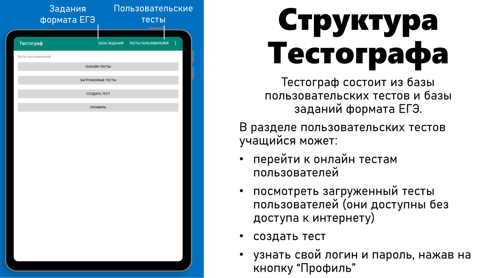
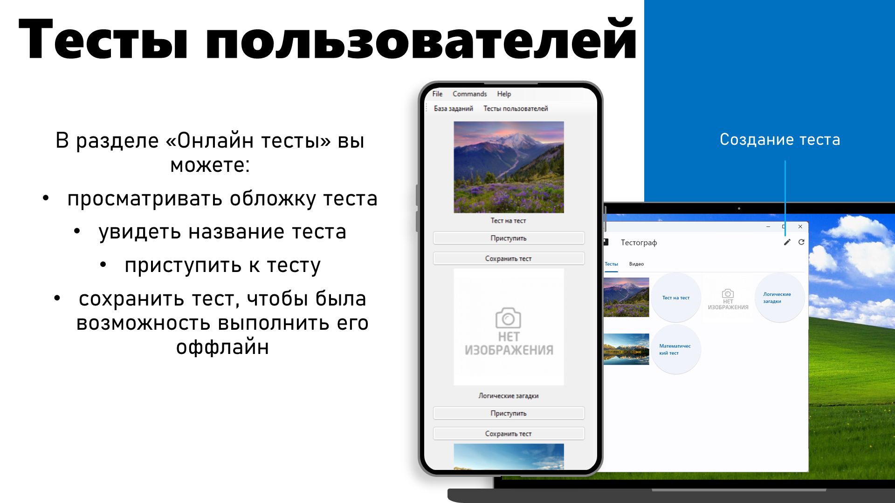
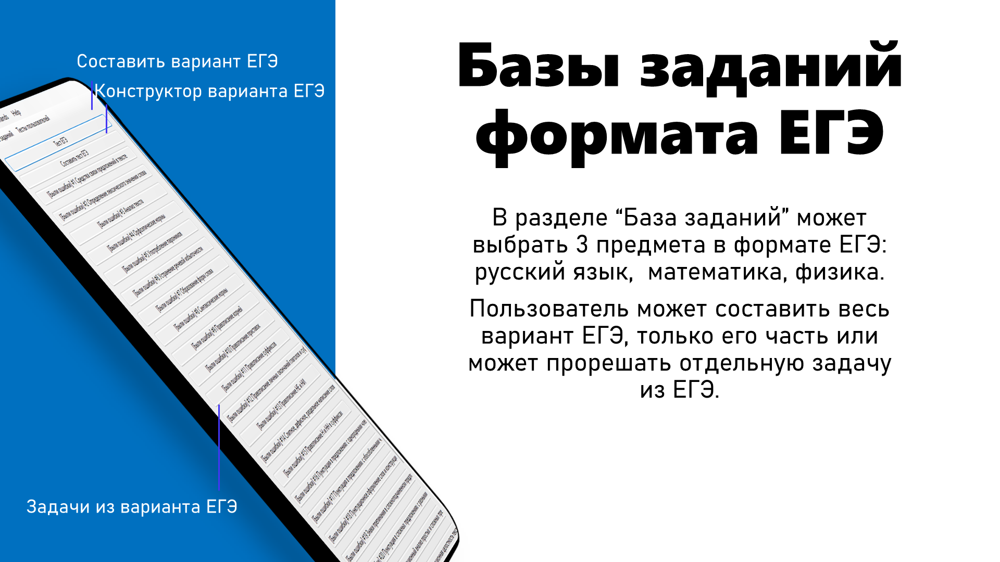
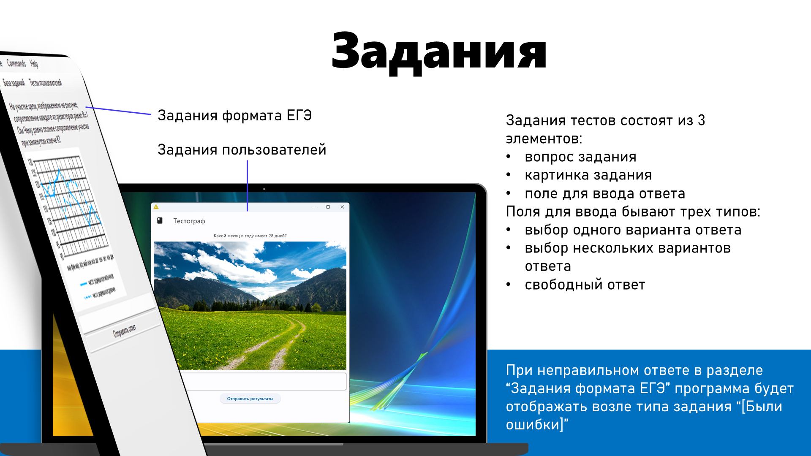
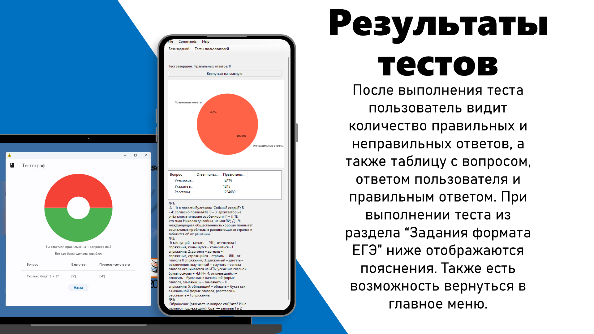
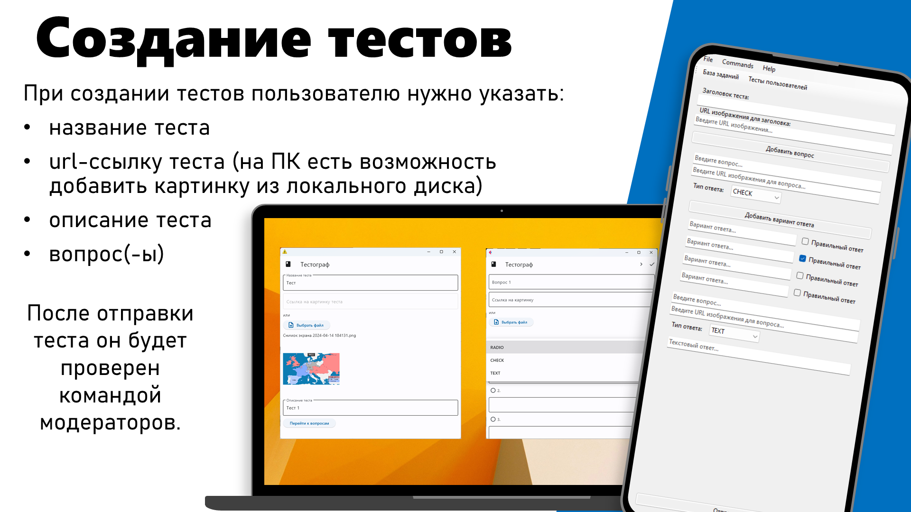

<div align="center">

# Тестограф

**Универсальная образовательная платформа для внешкольного самообучения**

*Школьный проект, 2024 год*

[](https://www.python.org/)
[](https://toga.readthedocs.io/)
[](LICENSE)
[](#)
[](#)

</div>

Тестограф — портативная образовательная платформа для свободного использования любым учеником в рамках дополнительного внешкольного самообучения. Главный элемент Тестографа — база заданий, постоянно пополняемая пользователями, плюс отдельная база заданий формата ЕГЭ по математике, физике и русскому языку.

📊 [Презентация проекта](Testograph.pptx)

> ⚠️ Этот репозиторий содержит только **мобильную версию** Тестографа (Android/Windows на BeeWare Toga). Версия для ПК (веб/десктоп) здесь не представлена.

## Содержание

- [Функционал](#функционал)
  - [Структура Тестографа](#структура-тестографа)
  - [Тесты пользователей](#тесты-пользователей)
  - [Базы заданий формата ЕГЭ](#базы-заданий-формата-егэ)
  - [Задания](#задания)
  - [Результаты тестов](#результаты-тестов)
  - [Создание тестов](#создание-тестов)
- [Технологии](#технологии)
- [Установка и запуск](#установка-и-запуск)
- [Сборка APK](#сборка-apk)
- [Структура проекта](#структура-проекта)
- [Авторы](#авторы)
- [Лицензия](#лицензия)

## Функционал

### Структура Тестографа

Тестограф состоит из базы пользовательских тестов и базы заданий формата ЕГЭ. В разделе пользовательских тестов учащийся может:

- перейти к онлайн-тестам пользователей;
- посмотреть загруженные тесты пользователей (они доступны без доступа к интернету);
- создать тест;
- узнать свой логин и пароль, нажав на кнопку «Профиль».



### Тесты пользователей

В разделе «Онлайн тесты» можно:

- просматривать обложку теста;
- увидеть название теста;
- приступить к тесту;
- сохранить тест, чтобы была возможность выполнить его оффлайн.



### Базы заданий формата ЕГЭ

В разделе «База заданий» доступны 3 предмета в формате ЕГЭ: русский язык, математика, физика. Пользователь может составить весь вариант ЕГЭ, только его часть, либо прорешать отдельную задачу.



### Задания

Задание теста состоит из трёх элементов: вопрос, картинка (опционально) и поле для ввода ответа. Поле для ввода бывает трёх типов:

- выбор одного варианта ответа;
- выбор нескольких вариантов ответа;
- свободный ответ.

При неправильном ответе в разделе «Задания формата ЕГЭ» рядом с темой задания программа отображает пометку «[Были ошибки]».



### Результаты тестов

После выполнения теста пользователь видит количество правильных и неправильных ответов и таблицу «вопрос — ответ пользователя — правильный ответ». При выполнении теста из раздела «Задания формата ЕГЭ» ниже отображаются пояснения к задачам. Также есть возможность вернуться в главное меню.



### Создание тестов

При создании теста пользователю нужно указать: название теста, url-ссылку на обложку (на ПК есть возможность добавить картинку с локального диска), описание и вопрос(-ы). После отправки тест будет проверен командой модераторов.



## Технологии

| Компонент | Назначение |
|---|---|
| [BeeWare Toga](https://toga.readthedocs.io/) / [Briefcase](https://briefcase.readthedocs.io/) | нативный UI и сборка под Windows и Android из одного кода на Python |
| [gistyc](https://github.com/ThomasAlbin/gistyc) | синхронизация тестов и пользователей через GitHub Gist |
| [Pillow](https://pillow.readthedocs.io/) | обработка изображений и рендер таблицы результатов |
| [matplotlib](https://matplotlib.org/) | круговая диаграмма результатов теста |
| [pandas](https://pandas.pydata.org/) | подготовка табличных данных для отчёта |
| [requests](https://requests.readthedocs.io/) | HTTP-запросы к GitHub Gist API |

## Установка и запуск

```bash
# создать и активировать виртуальное окружение (Python 3.12)
python -m venv .venv
.venv\Scripts\activate

# вписать свой токен GitHub Gist
# src/testograph_mobile/secrets.local.json.example -> secrets.local.json
copy src\testograph_mobile\secrets.local.json.example src\testograph_mobile\secrets.local.json

# запустить в режиме разработки
python -m briefcase dev
```

> `secrets.local.json` не коммитится в git (см. `.gitignore`) — токен всегда остаётся только у вас локально.

## Сборка APK

```bash
python -m briefcase package android -p debug-apk
```

Готовый файл появится в `dist/`. Это debug-сборка (подписана автоматическим debug-ключом Android) — устанавливается на устройство напрямую, но не подходит для публикации в Google Play. Для релиза потребуется собственный release-keystore.

## Структура проекта

```
Testograph-mobile/
├── pyproject.toml              # конфигурация Briefcase (сборка Windows/Android)
├── assets/slides/              # иллюстрации к README
└── src/testograph_mobile/
    ├── app.py                  # исходный код приложения (Toga)
    ├── questions_math.json     # база заданий ЕГЭ — математика
    ├── questions_phy.json      # база заданий ЕГЭ — физика
    ├── questions_rus.json      # база заданий ЕГЭ — русский язык
    ├── secrets.local.json.example
    ├── user.json / users.json / ircorrect.json / save_test.json
    └── image_sub/ image_save/  # локальные изображения к заданиям
```

## Авторы

Проект подготовлен командой школьного проекта 2024 года:

- Владимир Родичкин
- Евгений Парфёнов

## Лицензия

Проект распространяется под лицензией [BSD-3-Clause](LICENSE).
